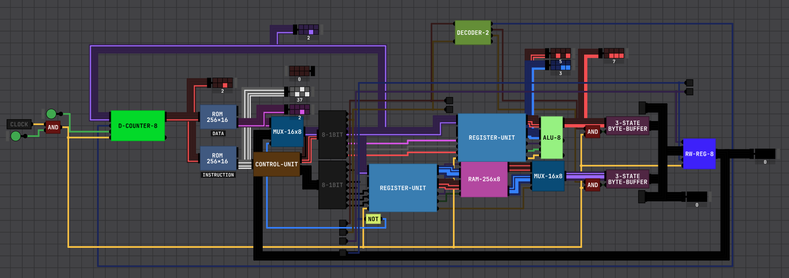

# 8-Bit CPU Documentation

### Assembly and Bytecode Instructions
Instruction | Bytecode | Assembly |
----------- | -------- | -------- |
`STORE` | [see below](#bytecode-math) | `str <lit/reg> <dist>` |
`READ` | [see below](#bytecode-math) | `read <reg> <dist>` |
`STORE-ALU-HIGH` | 39 | `str <lit/reg> r3` |
`STORE-ALU-LOW` | 38 | `str <lit/reg> r2` |
`STORE-ALU-OP` | 37 | `str <lit/reg> r1` |
`STORE-RAM-HIGH` | 7 | `str <lit/reg> r7` |
`STORE-RAM-LOW` | 6 | `str <lit/reg> r6` |
`STORE-RAM-OP` | 5 | `str <lit/reg> r5` |
`READ-OUTPUT-REG` | 16 | `read r0 <dist>` |
`READ-ALU` | 128 | `read r4 <dist>` |
`READ-RAM` | 64 | `read r8 <dist>` |
`STORE-OUTPUT-REG` | 8 | `str <reg> r0` |
`JUMP-WITH-STATIC` | 192 | `jmp <lit>` |
`JUMP-WITH-DYNAMIC` | 208 | `jmp r0` |

### Bytecode Math
`str` instructions always are `4 + <dist> + <reg?>`, if you are storing a literal value, you do not add it.\
`read` instructions are either `22 + <dist>`, `132 + <dist>`, or `68 + <dist>`, depending on where you are [reading from](DOCS.md#L16).[^note^](DOCS.md#L57)\
`jmp` instructions always are `192 + 16?`, if you are storing a literal value, do not add anything to the 192, if you are doing a dynamic jump instruction, add 16 to the 192.\
[Register bytecode values are shown below.](#registers)

### Registers
Assembly Registers | Informal Names | Size | Perms | Bytecode Value |
------------------ | -------------- | ---- | ----- | -------------- |
 `r0` | Output Register | 1 byte | Read/Write | 16/8 |
 `r1` | ALU OP Register | 4 bits | Write | 33 |
 `r2` | ALU Low Register | 1 byte | Write | 34 |
 `r3` | ALU High Register | 1 byte | Write | 35 |
 `r4` | ALU Output Register | 1 byte | Read | 128 |
 `r5` | RAM OP Register | 4 bits | Write | 1 |
 `r6` | RAM Low Register | 1 byte | Write | 2 |
 `r7` | RAM High Register | 1 byte | Write | 3 |
 `r8` | RAM Output Register | 1 byte | Read | 64 |

### CPU Pins
CPU Pins | Operation | Notes |
---- | --------- | ----- |
0-1 | ALU/RAM Register Multiplexer OP | 0 is nop, 1 is operand register, 2 is low byte register, 3 is high byte register |
2 | ALU/RAM Register Store | Store in current selected sub-register the byte given from the DATA wire, truncates high bits if storing in operand register |
3 | Output Register Write | Register will write zero if both pin 3 and 4 are high, do not pull 3 and 4 high at the same time |
4 | Output Register Read | Register will read zero if both pin 3 and 4 are high, do not pull 3 and 4 high at the same time |
5 | Choose between ALU Register or RAM Register | High is ALU, Low is RAM |
6-7 | 0 is nop, 1 is read RAM to output bus, 2 is read ALU to output bus, 3 is read DATA wire into program counter |  |

### Additional Notes
Operand Register is a 4-bit register.\
There are two ROMs, an Instruction ROM and a Data ROM.\
The Data ROM contains static data to be read into the CPU during runtime.\
The output register will override the input of the Data ROM if the Instruction ROM gives a `READ-OUTPUT-REG` signal (CPU pin 4 is pulled high).\
`read` and `str` instructions are essentially the same thing, just `str` instructions can take in *static data*, or data from the Data ROM. `read` instructions *only* take in data from other registers.
