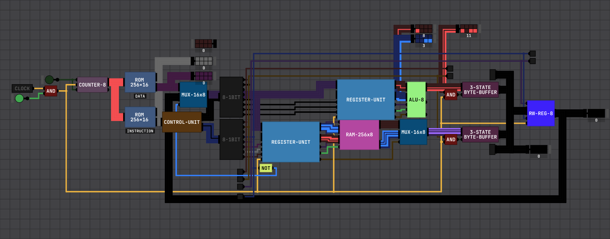

`STORE-ALU-HIGH` - 39\
`STORE-ALU-LOW` - 38\
`STORE-ALU-OP` - 37\
`READ-OUTPUT-REG` - 16\
`STORE-OUTPUT-REG-TO-ALU-HIGH` - 183\
`STORE-ALU-TO-REG` - 168

CPU Pins | Operation | Notes |
---- | --------- | ----- |
0-1 | ALU/RAM Register Multiplexer OP | 0 is nop, 1 is operand register, 2 is low byte register, 3 is high byte register |
2 | ALU/RAM Register Store | Store in current selected sub-register the byte given from the DATA wire, truncates high bits if storing in operand register |
3 | Output Register Write | Register will write zero if both pin 3 and 4 are high |
4 | Output Register Read | Register will read zero if both pin 3 and 4 are high |
5 | Choose between ALU Register or RAM Register | High is ALU, Low is RAM |
6-7 | 0 is nop, 1 is read RAM to output bus, 2 is read ALU to output bus, 3 is read DATA wire into program counter |  |

Operand Register is a 4-bit register.\
There are two ROMs, an Instruction ROM and a Data ROM.\
The Data ROM contains static data to be read into the CPU during runtime.\
The output register will override the input of the Data ROM if the Instruction ROM gives a `READ-OUTPUT-REG` signal (CPU pin 4 is pulled high).